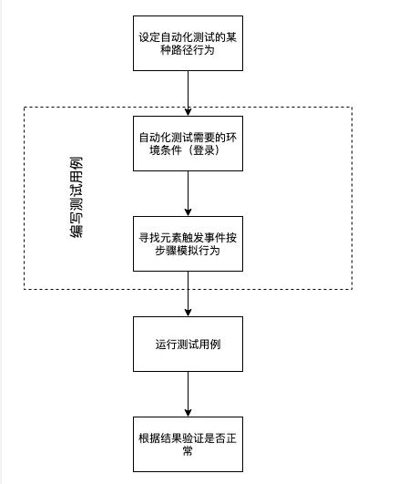

## 安装方法 
1、安装Node.js

2、安装 Cypress --创建项目目录进行初始化：npm init --检查package.json在项目的根目录中有文件夹或文件，以确保将cypress安装在正确的目录中。 --安装npm install cypress --save-dev

3、运行Cypress --在项目目录输入npm run test

## 项目说明
--本框架是为了实现端到端自动化测试，通过编写测试用例，自动化模拟用户操作，确保UI控件以及界面功能需求的正常实现

## 自动化测试流程图

## 目录简介  
├─cypress   …………cypress项目目录    
│   ├─fixtures     …………测试夹具  
│   ├─integration  …………案例源码  
│   ├─plugins      …………自定义插件       
│   ├─screenshots  …………截图存储  
│   ├─support      …………测试方法，存储整个系统中的测试方法，实现测试代码和测试用例分离  
│   ├─TestCase     …………测试用例文件夹  
│   └─videos       …………视频录制存储  
├─scripts  
├─mochawesome-report  
├─node_modules  
├─package-lock.json  
├─package.json  
├─cypress.json  

## 运行命令  
--npm run test   启动Cypress界面  
--npm run cypress:run   无界面运行测试用例  
--npm run cypress:report 无界面运行测试用例并输出测试报告  
--npm run cypress:chrome 启动谷歌游览器运行测试用例   

## 失败重试
--cypress.json/retries 指定失败次数,目前配置2次，总共运行三次  
